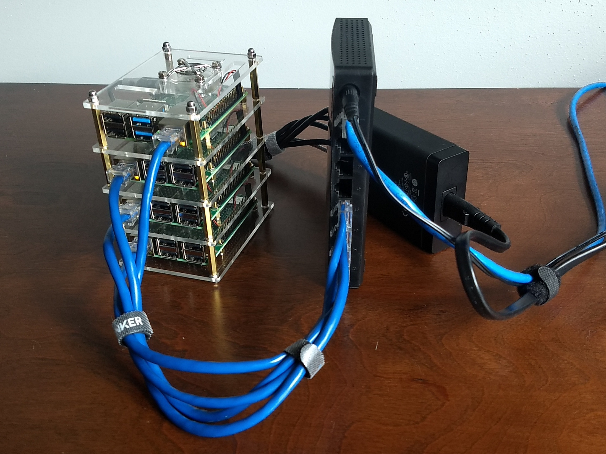

# Kubernetes on Rasberry Pi

A cluster of Raspberry Pis (a [bramble][]*) running Kubernetes (k8s), provisioned via Ansible.



## Prerequisites

### SSH access

    touch /Volumes/boot/ssh
    PW=`cat ~/.network.pw` envsubst < ~/dev/raspberrypi/wpa_supplicant.conf > /Volumes/boot/wpa_supplicant.conf

### Hardware

* Three or more Raspberry Pi 3 or 4
  * For the master node(s), I strongly recommend a Pi with at least 2GB RAM
* Class 10 SD Cards
* [Power](https://www.amazon.com/gp/product/B00P936188), [space](https://www.amazon.com/gp/product/B07MW24S61) and [cooling](https://www.amazon.com/gp/product/B0792BW2VH/)
* [Network switch](https://www.amazon.com/gp/product/B00A128S24/) and short ethernet cables
* Internet

### Software

* [Raspbian](https://www.raspberrypi.org/downloads/raspbian/) (installed on each Raspberry Pi)
* Raspberry Pis should have static IPs
    * Requirement for Kubernetes and Ansible inventory
    * You can set these via OS configuration or DHCP reservations (your choice)
* Ability to SSH into all Raspberry Pis and escalate privileges with sudo
    * The pi user is fine just change its password
* [Ansible](http://docs.ansible.com/ansible/latest/intro_installation.html) 2.2 or higher
* [`kubectl`](https://kubernetes.io/docs/tasks/tools/install-kubectl/) should be available on the system you intend to use to interact with the Kubernetes cluster.
    * If you are going to login to one of the Raspberry Pis to interact with the cluster `kubectl` is installed and configured by default on the master Kubernetes master.
    * If you are administering the cluster from a remote machine (your laptop, desktop, server, bastion host, etc.) `kubectl` will not be installed on the remote machine but it will be configured to interact with the newly built cluster once `kubectl` is installed.
* Setup SSH key pairs so your password is not required every time Ansible runs

### iptables

> The iptables tooling can act as a compatibility layer, behaving like iptables but actually configuring nftables. This nftables backend is not compatible with the current kubeadm packages: it causes duplicated firewall rules and breaks kube-proxy.

[Ensure iptables tooling does not use the nftables backend][kubeadm-iptables]

[kubeadm-iptables]: https://v1-16.docs.kubernetes.io/docs/setup/production-environment/tools/kubeadm/install-kubeadm/#check-network-adapters

    ansible-playbook iptables.yml

## Usage

Clone the repo

    git clone git@github.com:clebio/k8s-bramble.git

Modify the `inventory` file to suit your environment. Change the names
to your liking and the IPs to the addresses of your Raspberry Pis. If
your SSH user on the Raspberry Pis are not the Raspbian default `pi`
user modify `remote_user` in the `ansible.cfg`.

Confirm Ansible is working with your Raspberry Pis:

    ansible -m ping all

Configure the cluster:

    ansible-playbook cluster.yml
    ansible-playbook cluster.yml --tags provision

Set your kubeconfig (the config file is fetched in `cluster.yml` though):

    ansible bramble4 -m fetch -a 'src=/etc/kubernetes/admin.conf dest=./kube.config'
    export KUBECONFIG=kube.config/bramble4/etc/kubernetes/admin.conf
    kubectl cluster-info

Test your Kubernetes cluster is up and running:

    kubectl get nodes

To power the whole thing down,

    ansible all -m command -a shutdown

## Kubernetes manifests

Once you have a working cluster, there are a few resources I recommend installing:

### Ingress

* [Nginx Ingress controller on Bare Metal](https://kubernetes.github.io/ingress-nginx/deploy/baremetal/#a-pure-software-solution-metallb)

[MetalLB][metallb] provides a standard LoadBalancer service:

    kubectl apply -f manifests/metallb.yaml 
	kubectl apply -f manifests/metallb-config.yaml

In that MetalLB config, we defined a `certified` pool of size `/32` so that we can map that in our home router's NAT (external to this Bramble setup). If we then annotate the Nginx ingress configuration's LoadBalancer accordingly, we can create a predictable entrypoint to our private, NAT'd cluster.

```yaml
apiVersion: v1
kind: Service
metadata:
  annotations:
    metallb.universe.tf/address-pool: certified
spec:
  type: LoadBalancer
  # ...
```

    kubectl apply -f manifests/nginx-ingress-cloud.yaml
    
### NFS for PVCs

I use the [NFS client example][nfs-client] to provide persistent volume claims (PVC) via my Synology NAS:

    kubectl apply -f manifests/nfs-client-provisioner.yaml

### Dashboard

    kubectl apply -f example-manifests/kubernetes-dashboard-arm.yaml
    kubectl describe secret kubernetes-dashboard-token-8qksk -n kubernetes-dashboard


## Diagnostics

Raspberry Pi aren't terribly large machines. You might run out of resources. One quick and dirty check:

     ansible -i inventory all -m shell -a 'cat /proc/meminfo | grep -i memfree'

## References & Credits

These playbooks were assembled using a handful of very helpful guides:

* Thanks to [Jeff Geerling for the "bramble" reference][geerling].
* This repo is derived from [rak8s](https://github.com/rak8s/rak8s).
* [K8s on (vanilla) Raspbian Lite](https://gist.github.com/alexellis/fdbc90de7691a1b9edb545c17da2d975) by [Alex Ellis](https://www.alexellis.io/)
* [Installing kubeadm](https://kubernetes.io/docs/setup/independent/install-kubeadm/)
* [kubernetes/dashboard - Access control - Admin privileges](https://github.com/kubernetes/dashboard/wiki/Access-control#admin-privileges)
* [Install using the convenience script](https://docs.docker.com/engine/installation/linux/docker-ce/debian/#install-using-the-convenience-script)
* A very special thanks to [**Alex Ellis**](https://www.alexellis.io/) and the [OpenFaaS](https://www.openfaas.com/) community for their assitance in answering questions and making sense of some errors.

[bramble]: https://elinux.org/Bramble
[geerling]: https://www.jeffgeerling.com/project/raspberry-pi-dramble
[metallb]: https://metallb.universe.tf/
[nfs-client]: https://github.com/kubernetes-incubator/external-storage/tree/master/nfs-client
